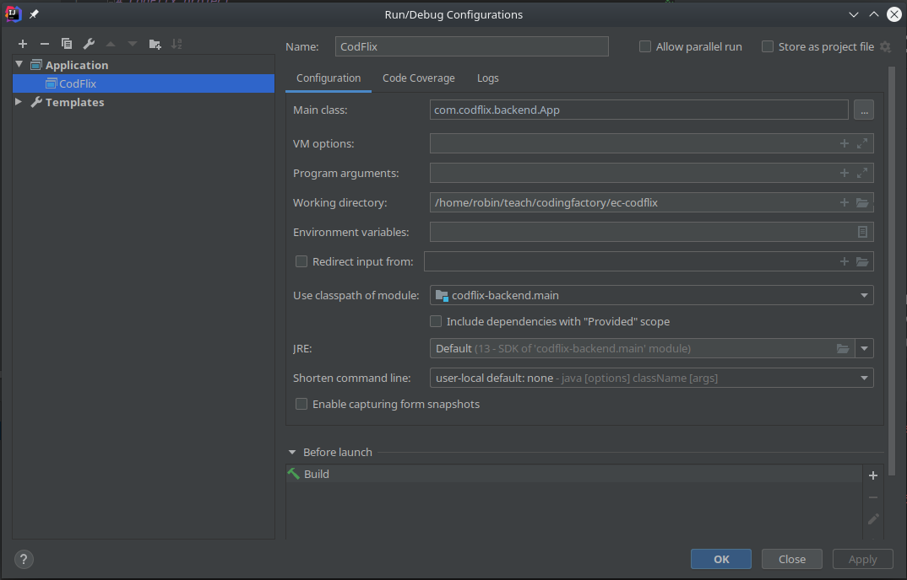
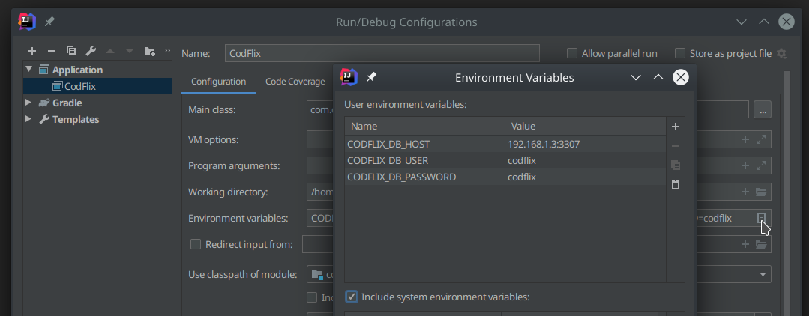
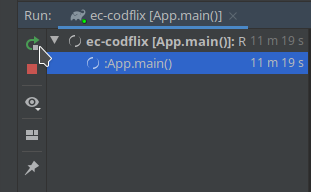
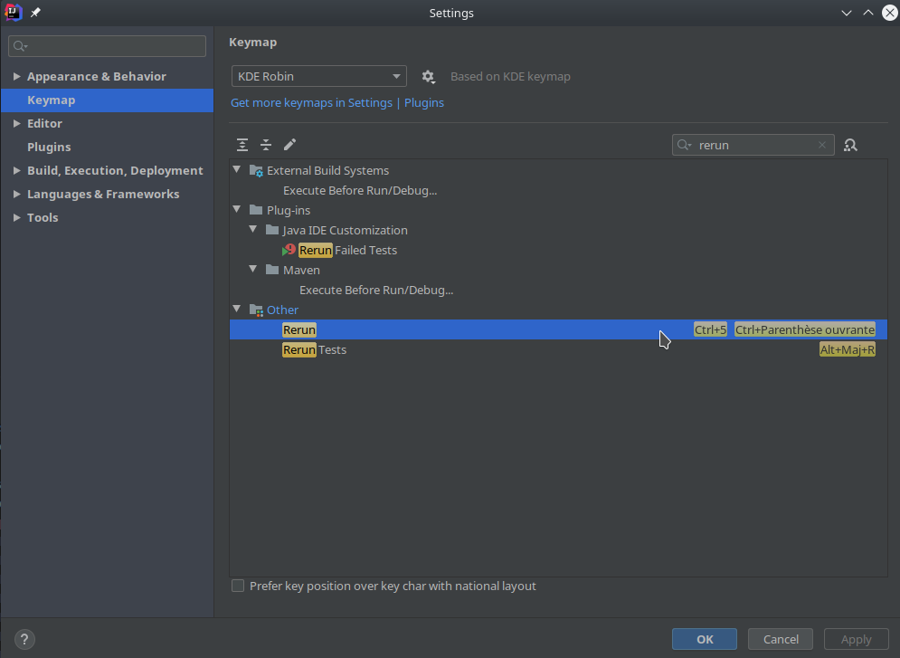

# Cod'Flix project

## Project structure
The entry point of the project is the `App` class. It will connect to the database and start the server.

* The source code is located in the directory `src/main/java`
* The assets (images, JSS, JS, HTML templates) are located in `src/main/resources`
* The database (MySQL) initialization script is at the root of the project `codflix.sql`

The build system relies on Gradle. If you want to add Java libraries, you can add them in the `build.gradle` file.

## Framework & Libraries
To speed up web development, Cod'Flix Java uses:
* [The Spark](http://sparkjava.com/) framework to handle the routing, requests and responses handling, etc.
* [Velocity]( http://velocity.apache.org/engine/2.2/user-guide.html ) template engine to render dynamic HTML pages

Take the time to look at their documentation to learn how to develop in the CodFlix project.

## Setup

### Run configuration
Once the project has been opened in IntelliJ, a Run Configuration has to be created.
1. In the top toolbar, click in the combo **Add / Edit Configurations**
1. Click on the top left **+** sign
1. Select **Application**
1. In the right pane, update the **Name** field with `CodFlix`
1. In the right pane, update the **Main Class** field with `com.codflix.backend.App`
1. In the right pane, update the **Use classpath of module** field with `codflix-backend.main`

The resulting configuration should look like this:


### Database 
You must have a running MySQL service on your development machine. Cod'Flix has to be configured to properly access your MySQL database:
1. Open your run configuration **Edit Configurations**
1. Select your **CodFlix** Application
1. Click on the icon in the far right of the field **Environment variables**
1. Set the following environment variables with your MySQL configuration:
  * `CODFLIX_DB_HOST` The hostname and port to connect to you database. Usually `localhost:3307`
  * `CODFLIX_DB_USER` The database user. Usually `root`
  * `CODFLIX_DB_PASSWORD` The password of the database user
  
The resulting configuration should look like this:


### Expected run behavior
When the server is properly running, you should see the following logs:
```
[main] INFO com.codflix.backend.core.Database - The driver name is MySQL Connector/J
[main] INFO com.codflix.backend.core.Database - Connection to database up and running!
... some more logs
[Thread-0] INFO org.eclipse.jetty.server.AbstractConnector - Started ServerConnector@19afa3c5{HTTP/1.1,[http/1.1]}{0.0.0.0:8080}
[Thread-0] INFO org.eclipse.jetty.server.Server - Started @633ms
```

You can now access the running site at http://localhost:8080/.

### Dev workflow
Because Java is a compiled language, each code modification forces a server restart. You can restart the server in the **Run** bottom panel:



**Note: you don't have to restart the server when you change an HTML template or a JS/CSS file.**

To win some time, there is a keyboard shortcut to execute the Rerun action (default is `Ctrl + 5`). IntelliJ has some issues with french keyboards. You can remap this **Rerun** action in the **Settings**:


